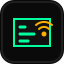

<p align="center">
  
</p>

<h1 align="center">RTK-Base</h1>

<p align="center">A Raspberry Pi RTK base station with an RTCM correction stream and a live GNSS diagnostics dashboard.</p>

<p align="center"><strong>Dashboard version 0.9.8</strong></p>

## What it does

RTK-Base connects a u-blox GNSS receiver to a Raspberry Pi and forwards the
receiver's RTCM 3 corrections to clients over TCP. The dashboard reports the
Pi, network, stream, receiver, and satellite status.

- Streams RTCM 3 over TCP, preferring port **2101** and selecting a free port
  from **2102–2120** if 2101 is already occupied
- Starts the stream and dashboard services at boot
- Switches the receiver between correction streaming and GPS telemetry
- Shows receiver position, fix, altitude, DOP, signal strengths, and satellites
- Includes a receiver map, sky plot, and an interactive approximate 3D GNSS view
- Provides system and network diagnostics, logs, configuration downloads, and
  a repository file tree

## Hardware

- Raspberry Pi running Raspberry Pi OS
- u-blox GNSS receiver, such as a ZED-F9P or NEO-M8P
- GNSS antenna with a clear view of the sky
- USB connection between the receiver and Raspberry Pi

The receiver must be configured to output RTCM 3 messages for base operation.
Setup installs the Pi software but does not configure the receiver itself.

## Install

Clone the repository on the Pi and run the setup script:

```bash
git clone https://github.com/DirectedHunt42/RTK-Base.git
cd RTK-Base
chmod +x setup.sh
sudo ./setup.sh
```

Connect the receiver before setup so the installer can find its
`/dev/serial/by-id` device. Setup installs RTKLIB (`str2str`), GPSD, Flask,
nginx, and the RTK-Base services. When setup finishes, open
`http://<pi-ip>` in a browser.

## Connect a client

In Mission Planner, open **Setup → Optional Hardware → RTK/GPS Inject**, select
**TCP Client**, and enter the Pi's IP address and active RTCM port. Leave both
NTRIP options unchecked.

Port 2101 is preferred. If it is busy, RTK-Base selects the first available
port between 2102 and 2120. The active port appears in the dashboard's System
panel and in setup's completion message. Configure the client to use that port.

## Receiver setup

For an RTK base, configure the receiver to use a surveyed or fixed base position
and output RTCM 3 over its USB/serial connection. Include observation messages
(for example, GPS MSM) and a reference position message such as RTCM 1005.
Keep the antenna stationary during survey-in.

Receiver configuration differs by model. The
[CubePilot HERE 3 manual](https://github.com/CubePilot/cubepilot-docs/blob/master/here-3/here-3-manual.md)
describes its base survey and RTCM status workflow.

## Operating modes

The **GNSS / GPS** panel switches between two exclusive modes because the
receiver has one configured serial connection:

- **RTCM corrections**: `str2str` owns the receiver and serves corrections to
  connected clients.
- **GPS telemetry**: GPSD owns the receiver and provides fix, position, and
  satellite data to the dashboard. The RTCM stream pauses in this mode.

Switch back to **RTCM corrections** before connecting Mission Planner to the
correction stream. A running service and an open TCP port do not by themselves
confirm that valid RTCM messages are reaching the client.

## Dashboard

The dashboard refreshes its diagnostics automatically. Panel headings collapse
and expand, and the browser remembers each panel's state.

In GPS telemetry mode, the dashboard can show the receiver on an OpenStreetMap
map, a satellite sky plot, signal bars, DOP values, and GPSD's estimated
accuracy and fix time. Map tiles require an internet connection.

The 3D GNSS view can be dragged to rotate and scrolled to zoom. Hover over a
satellite for its signal and sky details. The plotted positions and recent
trails are approximate: GPSD supplies azimuth and elevation, while the view uses
representative constellation orbit heights rather than each satellite's live
ephemeris.

The **Files** button provides selected logs and installed configuration files.
The **README** button opens this guide in the dashboard. The **Update** button
pulls the latest repository version and runs setup again. Updating runs
`git reset --hard` in the configured checkout, so tracked local changes there
are discarded.

## Check services and stream

```bash
# Check service state
sudo systemctl status str2str rtk-dashboard nginx

# See the selected RTCM port and listening sockets
cat /var/lib/rtk-base/stream-port
sudo ss -ltnp

# Inspect recent stream output
sudo journalctl -u str2str -n 50 --no-pager
```

These checks confirm that the Pi-side services are running. They do not confirm
that the receiver has a valid GNSS fix or is producing usable RTCM corrections.

## Troubleshooting

- **Receiver not detected:** connect it before setup and check that it appears
  under `/dev/serial/by-id`.
- **No GPS telemetry:** switch to GPS telemetry mode, check the antenna view,
  and confirm the receiver is sending GNSS data to GPSD.
- **No RTCM connection:** switch back to RTCM corrections, check the active
  port in the System panel, and use that port in the client.
- **Client connects but no RTK solution:** verify the receiver's base position
  and RTCM output, including observation and reference-position messages.
- **Need service logs:** use `sudo journalctl -u <service> -n 100 --no-pager`,
  replacing `<service>` with `str2str`, `rtk-dashboard`, or `nginx`.

## Services and ports

| Service | Address | Purpose |
| --- | --- | --- |
| Dashboard | `http://<pi-ip>` (port 80) | Diagnostics and receiver telemetry |
| RTCM stream | `tcp://<pi-ip>:<active-port>` | Corrections for RTK clients |
| GPSD telemetry | Local service | Receiver data while telemetry mode is active |

Made for practical RTK base station monitoring in the field.
